<center><h1>项目2 实验报告

# 一、源代码

## 项目结构

```
ai-course-hw2/
├── 人工智能原理课程项目2.pdf                  # 【文档】作业说明
│
├──STL10/
│   ├──test/            				   #测试集
│   └──train/							   #训练集
│
├──outputs/                                #输出
│   ├──baseline/						   #基准训练结果，未进行优化
│   ├──aug_on/							   #采用数据增强后的训练结果
│   ├──model_variant/					   #采用Sigmoid/Leaky ReLU激活函数、average池化、 
│   │    │                                 dropout正则化后的结果
│	│	 ├──sigmoid/					   #采用Sigmoid激活函数获得的结果
│	│	 └──leaky_relu/					   #采用Leaky ReLU激活函数获得的结果
│   ├──optim_variant/					   #采用随机梯度下降优化器，学习率为0.01的结果
│   ├──grad_cam/						   #使用Gard-cam可视化方法输出的结果
│   │	└──grad_cam.png
│   ├──accuracy_curves.png				   
│   ├──confusion_matrix.png				   
│   ├──loss_curves.png					   
│   ├──best_model.pt					   
│   └──classification_report.txt           #模型分类报告
│
├──training.py							   #基准训练代码
│
├──experiments.py						   #模型优化分析相关代码
│
└──grad_cam.py							   #可视化相关代码
```

outputs文件夹中，每个子文件夹都含有outputs文件夹下的5个训练结果文件。

## 设计思路

### 1.卷积神经网络

**结构：**

输入$96\times96\times3$的图像

卷积层1：卷积核 $3 \times 3 \times 3$，卷积核数 32，步长 1，填充 1。   

池化1：最大池化，窗口 $2 \times 2$，步长 2。  

卷积层2：卷积核 $3 \times 3 \times 32$，卷积核数 64，步长 1，填充 1。  

池化2：最大池化，窗口 $2 \times 2$，步长 2。  

卷积层3：卷积核 $3 \times 3 \times 64$，卷积核数 128，步长 1，填充 1。    

卷积层4：卷积核 $3 \times 3 \times 128$，卷积核数 256，步长 1，填充 1。   

全局平均池化：输出尺寸$1\times1$

**设计思路：**

通道数逐层增加（32→64→128→256），增强特征表达能力。

前两层卷积中使用池化快速降低采样，降低计算量并扩大感受野。

后两层保持较多空间信息，用更高的通道提升模型的判别能力。

最后通过全局平均池化减少参数并降低过拟合风险。

### 2.测试方法

训练过程中用测试集准确率挑选并输出最优权重best_model.pt。

训练结束后加载该最优权重，用测试集做一次完整推理，计算总体准确率，并输出Precision、Recall与 F1 分数，混淆矩阵，从而全面评估模型的分类能力与各类别表现差异。

### 3.评价指标

评价指标包括总体准确率与宏平均精确率/召回率/F1。准确率衡量模型整体预测正确的比例；宏平均指标对每个类别分别计算后再平均，能更公平地反映各类别表现，避免类别不平衡时被主导类别掩盖。

## 二、实验数据分析

### 1.原始模型

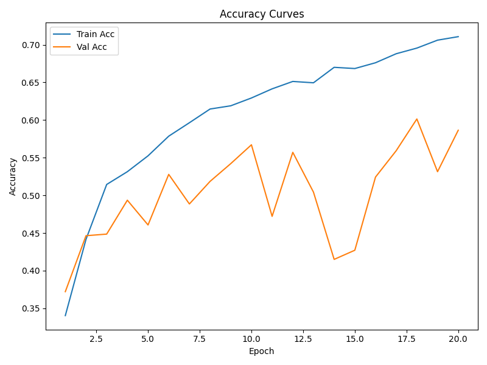

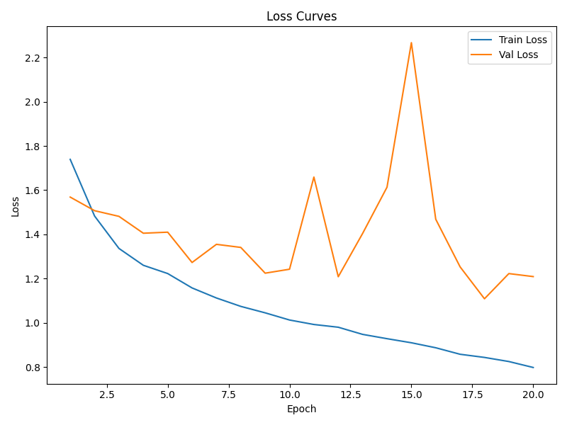

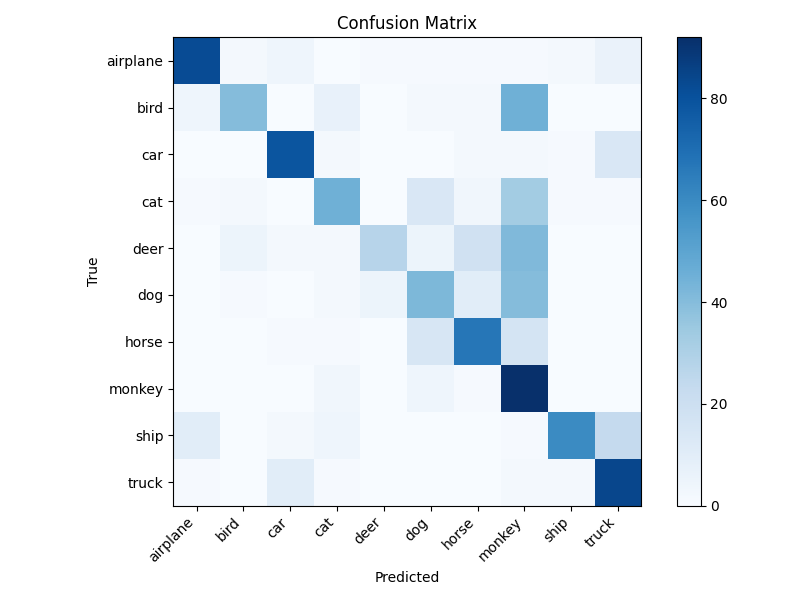

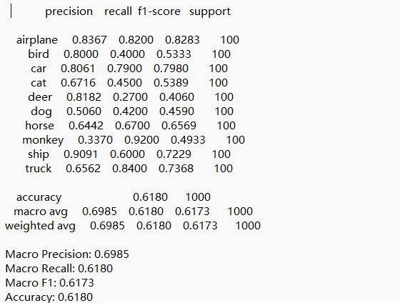

从准确率曲线看，训练集准确率随epoch稳步上升，最终约为0.71；测试集准确率整体缓慢上升但波动较大，训练与验证之间存在明显间隔，说明模型有一定过拟合或样本方差影响。损失曲线中训练损失持续下降，而测试损失在中后期出现较大起伏后回落，表明模型稳定性不足。混淆矩阵显示交通工具类预测较稳定；动物类之间混淆更明显，尤其 bird、deer、cat、dog 与 monkey 相互误判较多，其中 monkey 列偏亮，说明模型倾向于将多类样本误判为 monkey。总体来看模型对结构差异明显的类别更有优势，对外观差异不太明显的动物类区分能力不足。

原始模型在测试集上的总体准确率为 0.618，宏平均 Precision/Recall/F1 分别为 0.6985/0.6180/0.6173，说明整体性能中等且各类别表现差异较大。airplane、car、ship、truck 的 F1 较高，识别相对稳定；而 deer、bird、cat、dog 的召回率偏低，是主要短板。特别是 monkey 类别召回率很高但精确率很低，表明模型对该类过度预测，存在明显混淆。可见模型能够抓住部分交通工具类特征，但在动物类区分上仍不足。

### 2.通过水平翻转和随机裁剪进行数据增强后的模型

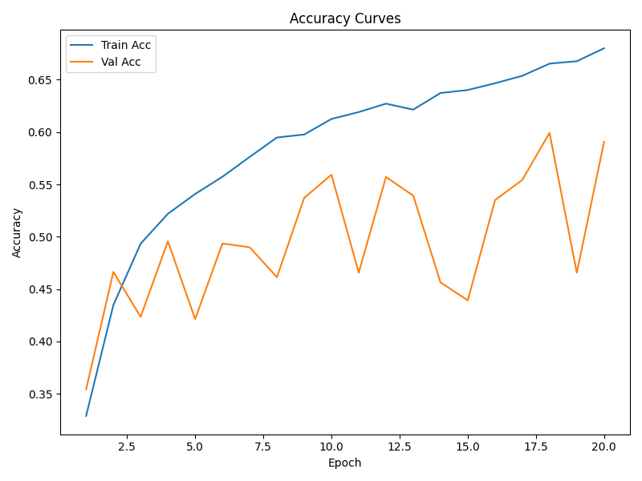

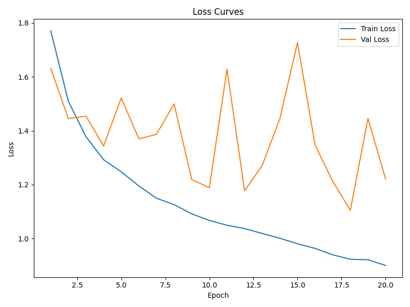

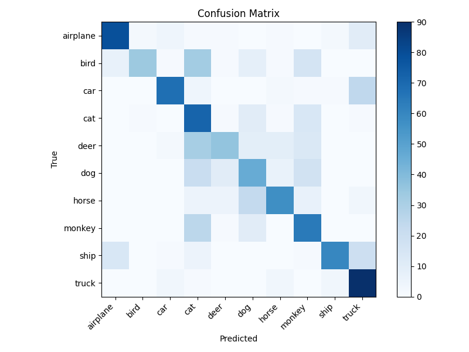

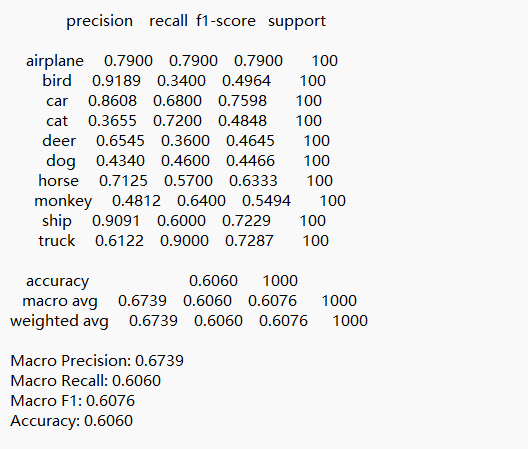

从准确率曲线来看，训练准确率随 epoch 持续上升，最终约 0.68，测试准确率整体波动仍较大，最高约 0.60，说明数据增强提升了训练效果但仍存在过拟合影响。损失曲线中训练损失平滑下降到约 0.9，而验证损失在中后期多次出现峰值（最高约 1.7），表明模型仍不够稳定。混淆矩阵显示交通工具类依然更容易识别，truck、car、airplane 的对角线较深；动物类之间仍有较强混淆，尤其 cat、deer、dog、bird 相互误判较多。

测试集准确率为 0.606，宏平均 Precision/Recall/F1 为 0.6739/0.6060/0.6076。相较原始模型，总体指标略有下降，说明这组增强配置未带来整体收益；但在个别类别上有变化，例如 cat 的召回率提升到 0.72，而 bird、deer 的召回率仍偏低。表明当前增强策略对模型判别边界的稳定性帮助有限，类别间仍有较突出的混淆问题。

### 3.采用Sigmoid/Leaky ReLU激活函数、average池化、dropout正则化后的模型

#### 1)Sigmoid激活函数

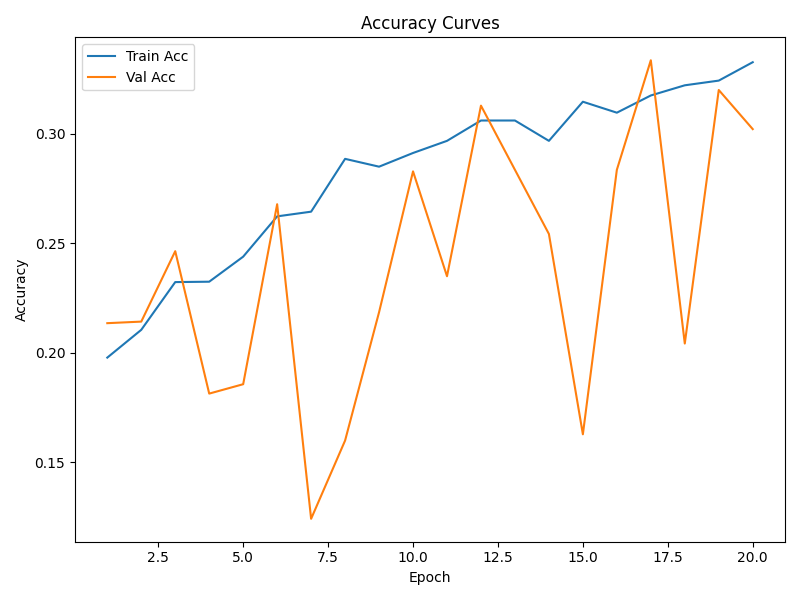

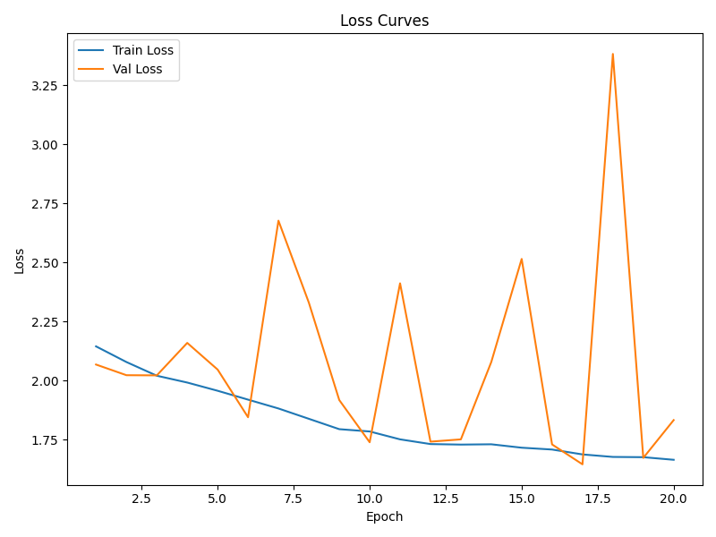

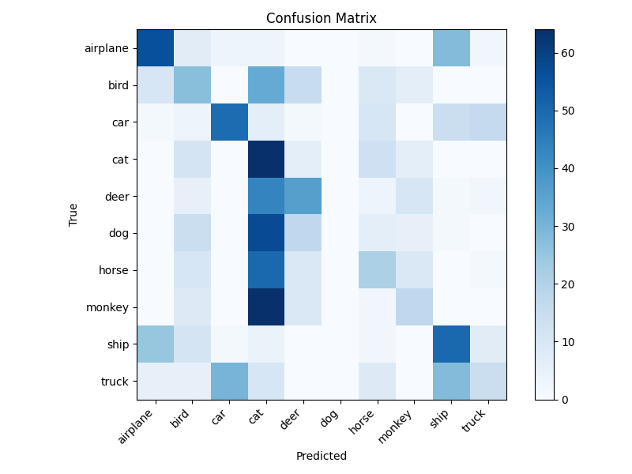

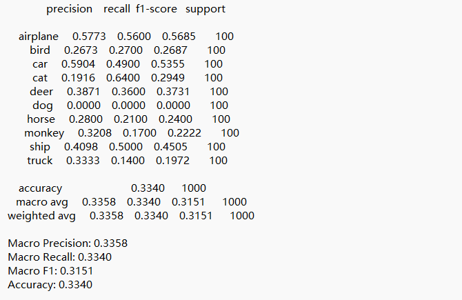

Sigmoid 激活函数模型的表现明显下降。准确率曲线显示训练准确率缓慢上升但整体水平较低（低于0.35），验证准确率大幅波动，最高也仅在 0.32 左右，说明训练难以有效收敛。损失曲线中训练损失虽在下降，但验证损失频繁出现尖峰（最高超过 3.3），非常不稳定。混淆矩阵中“cat”列明显偏亮，多个类别被大量误判为 cat，说明模型在决策边界上出现严重偏置。

量化指标上，测试准确率仅 0.334，宏平均 Precision/Recall/F1 为 0.3358/0.3340/0.3151。类别层面甚至出现 dog 的召回率和精确率都为 0，表明模型几乎无法识别该类。Sigmoid 在该网络中导致梯度饱和与训练效率下降，模型判断能力受限，分类能力大幅下降。

#### 2)Leaky ReLU激活函数

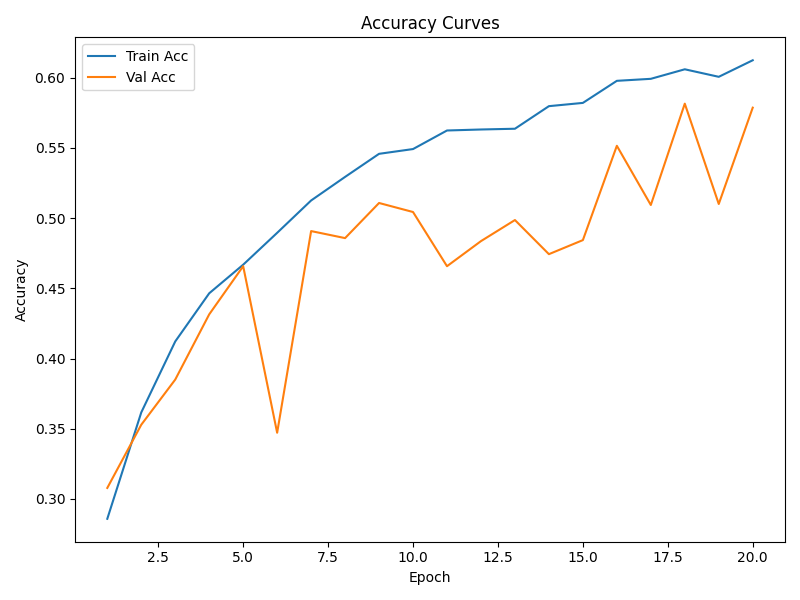

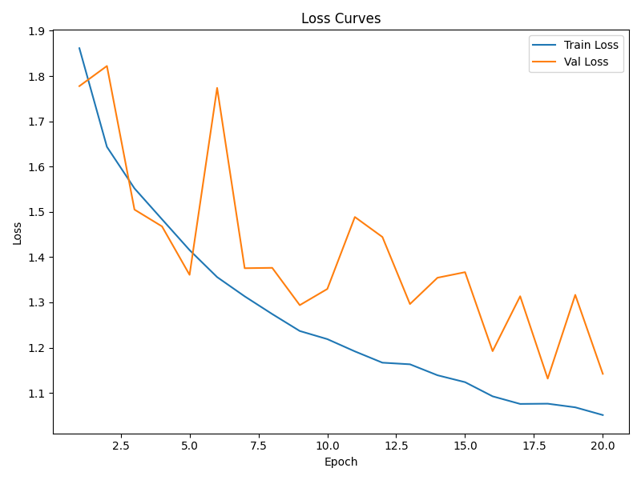

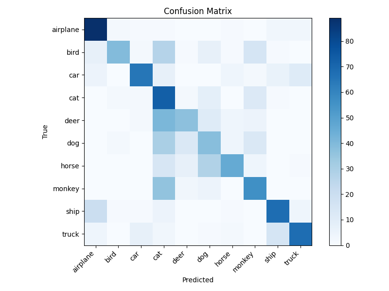

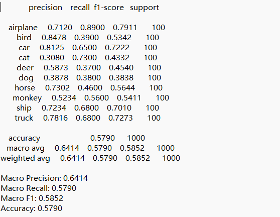

Leaky ReLU 模型的训练曲线更平稳，训练准确率从约 0.29 提升到 0.61，验证准确率整体上升到约 0.58，波动明显小于 Sigmoid，说明模型训练过程中更稳定。损失曲线中训练损失持续下降，验证损失整体缓慢下降但仍有阶段性波动，较原始模型略不稳定但比 Sigmoid 明显更好。混淆矩阵中对角线较深，交通工具类识别仍占优势；动物类仍存在混淆，但整体错误分布更分散，未出现单一类别被大量误判的极端情况。

量化指标方面，测试准确率为 0.579，宏平均 Precision/Recall/F1 为 0.6414/0.5790/0.5852，整体低于原始模型但显著高于 Sigmoid。类别上，airplane、car、ship、truck 的 F1 依然较好；cat 的召回率较高但精确率偏低，说明仍存在过度预测。综合来看，Leaky ReLU 让训练更稳定、性能介于原始模型与 Sigmoid 之间，但没有带来整体提升。

### 4.采用随机梯度下降优化器，学习率为0.01的模型

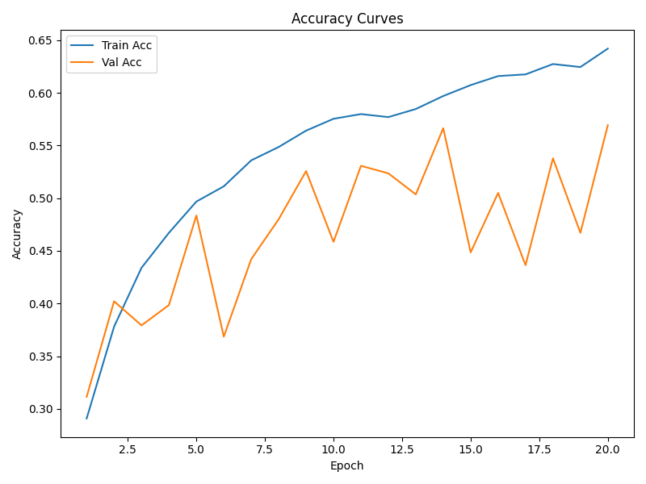

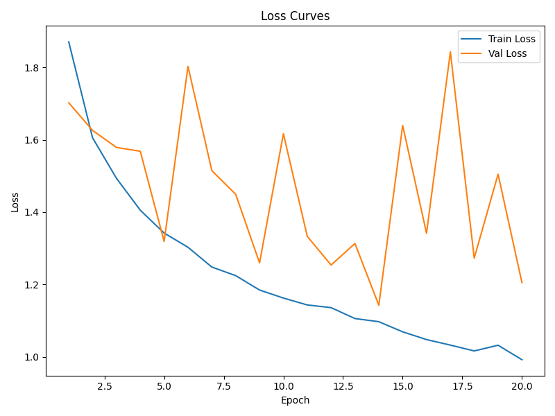

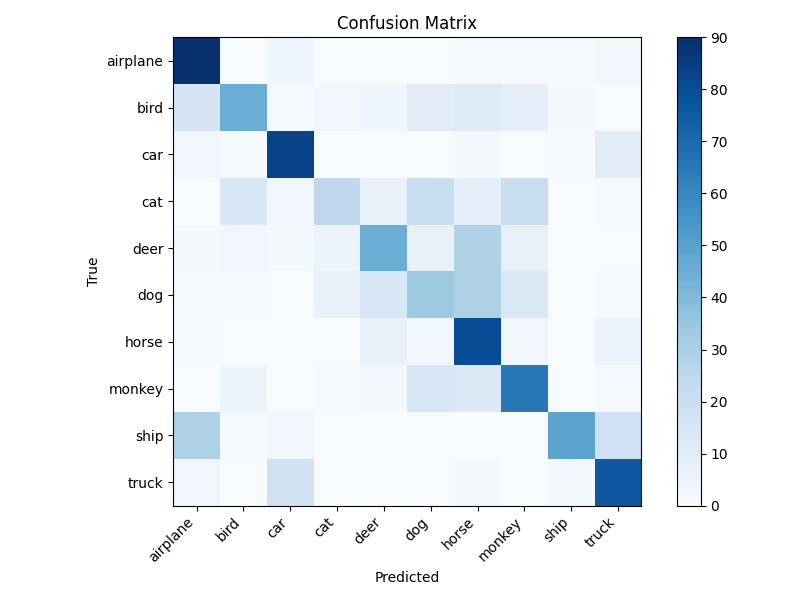

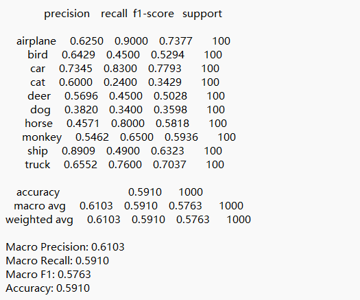

可见模型的训练曲线较平稳，训练准确率逐步提升到约 0.64，验证准确率在 0.30–0.57 区间波动，整体略低于原始模型但波动幅度中等。训练损失持续下降到约 1.0，验证损失呈锯齿状起伏，仍不稳定。混淆矩阵中交通工具类对角线较清晰，识别效果较好；动物类仍有明显混淆，尤其 cat、deer、dog、horse 之间交叉误判较多。

测试准确率为 0.591，宏平均 Precision/Recall/F1 为 0.6103/0.5910/0.5763，整体低于原始模型（0.618）但明显优于 Sigmoid。类别上，airplane、car、truck 的 F1 较高，horse 与 monkey 的召回率较高但精确率一般；cat 的召回率偏低。SGD 在当前学习率下收敛尚可，但性能略弱于使用Adam优化器的原始模型。

## 三、可解释性分析

### 动物类分类正确案例：

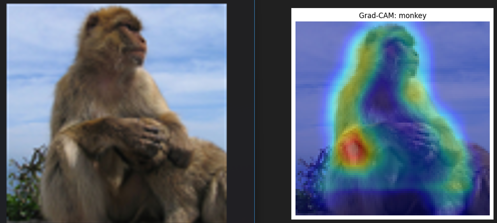
热区主要集中在猴子的躯干和上身轮廓，尤其是前臂附近区域最亮，说明模型主要依据主体形态和毛发纹理进行判断，而背景响应较弱。这表明模型在该样本上确实关注到与“猴子”类别相关的关键视觉特征，预测依据合理，属于较可靠的可解释性结果。

### 动物类分类错误案例：

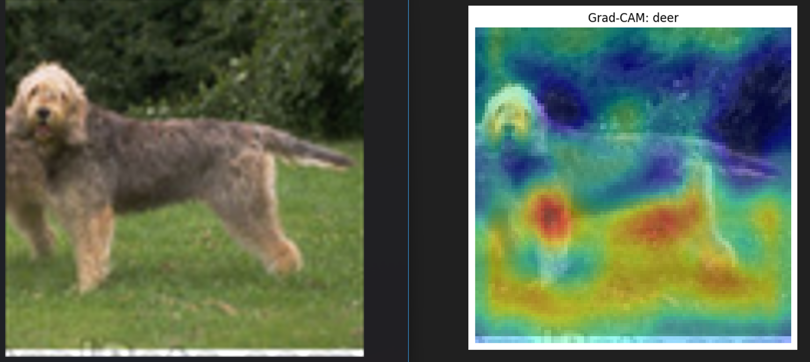

热区主要集中在狗的四肢、背景，尤其是狗的后腿与前肢的上半部分和背景中的草地，说明模型主要依据模型收到背景干扰，未能抓住狗的特征。部分特征+背景干扰导致了模型对于狗与鹿等部分外观相对类似的动物的误判。

### 交通工具类分类正确案例：

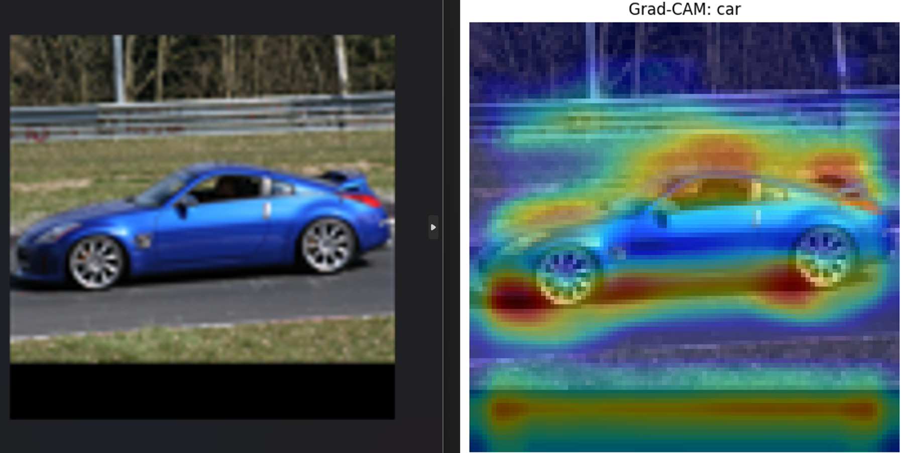

热区主要集中在车身底部、车顶、车窗、前盖等部分，说明模型抓住了汽车的关键结构特征。背景对于模型的影响相对较弱，模型对于汽车的特征更敏感，预测依据合理，较为可靠。

### 交通工具类分类错误案例：

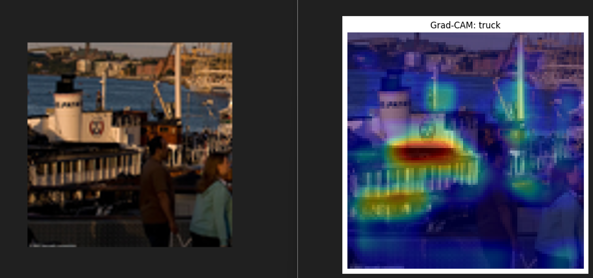

热区集中在船体中部的条纹、窗格和背景中的竖直桅杆，这些特征与卡车的车窗、侧面集装箱的条纹等特征相似，导致模型将船只误判为卡车，说明模型在复杂情况下容易依赖局部特征和纹理来判断对象，容易产生误判。

## 四、实验结果的理性思考与结论

综合实验结果可见，基准模型在 STL10 上能够较好地区分交通工具类，但对动物类的细粒度差异仍难以把握，混淆主要来自外观相近类别。

数据增强在当前设置下未能带来整体性能提升，说明简单的翻转与裁剪对该模型的改善效果有限。

激活函数对训练稳定性影响显著，Sigmoid 导致梯度饱和、模型性能大幅下降；Leaky ReLU 虽更稳定，但整体仍弱于原始模型。

优化器方面，SGD 在学习率 0.01 下收敛可用，但泛化性能略弱于 Adam。

同时也可以发现，模型对于训练集的准确率与训练次数呈明显正相关，但测试集的准确率与训练次数整体上看属于波动上升，训练次数增多不一定会对测试集起正向的效果。

结论：当前模型能完成基础分类任务，但在动物类区分与复杂背景鲁棒性上仍有明显提升空间，后续可通过更换更合适的数据增强算法、以及进行更精细的参数调整进一步改进。


## AI辅助声明

本作业在 **Gemini - 3.2+Github Copilot ** 的辅助下完成，主要帮助理解了torch库中大量函数的使用方法，

部分算法的debug及报告的语言润色亦使用了上述工具的帮助，主要通过复制相关报错信息提问及分析具体代码实现。

算法设计、功能取舍、代码调试与最终结果验证由本人独立完成。本人已逐段检查并理解所有提交代码，对作业内容与结果负责。
